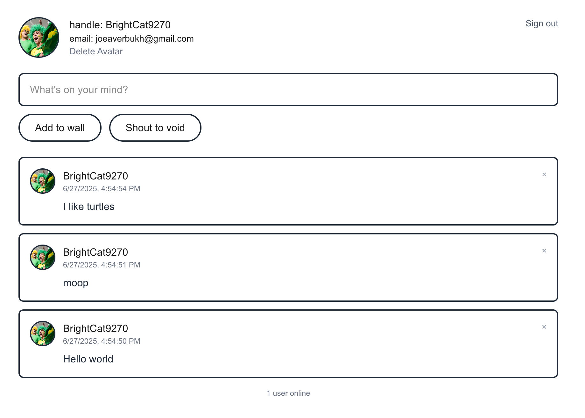

# Instant Shout Wall


This is a demo app built with [InstantDB](https://instantdb.com), Next.js, and TailwindCSS with the following features:

* Initiailizes a connection to InstantDB
* Defines schema and permissions for the app
* Authentication with magic codes
* Reads and writes data via `db.useQuery` and `db.transact`
* Ephemeral features like who's online and shout
* File uploads for avatars

Logic is split across four files:

* `app/page.tsx` - Main logic, mostly UI with some Instant magic :)
* `lib/db.ts` -- InstantDB client setup
* `instant.schema.ts` - InstantDB schema, gives you type safety for your data!
* `instant.perms.ts` - InstantDB permissions, not required for this app, but we still included to show how to restrict access to your data.

[See it live](https://instant-shout-wall.vercel.app/)

## Quick Start
```bash
# Clone repo and install dependencies
pnpx create-next-app instant-shout-wall -e https://github.com/nezaj/instant-shout
cd instant-shout-wall

# Create a new InstantDB project
pnpx instant-cli@latest login # Login to your InstantDB account
pnpx instant-cli@latest create-app # Paste your app id into env.local

# After copying the app id from the previous step into .env.local run the
# following command to push the schema and permissions to InstantDB
pnpx instant-cli@latest push

# Run the app
pnpm run dev
```
